# aidenyang.me

Bilingual portfolio of **Xuejian (Aiden) Yang**, Design Engineer in Sydney — with an AI assistant that answers questions about the work.



**Live:** [aidenyang.me](https://aidenyang.me) · EN / 中文
**Case study:** [aidenyang.me/projects/this-site.html](https://aidenyang.me/projects/this-site.html)

## What's in it

- **Homepage** — eight case studies: four shipped products and four design projects.
- **Interactive case studies** — each product page has a clickable architecture diagram; the Chunks page has a working replica of the app.
- **AI assistant** — a chat widget grounded in `knowledge.md`, running on a Cloudflare Worker. Costs about $3 a month.
- **Bilingual** — every piece of copy carries `data-en` / `data-zh`; the toggle swaps them in place.

## How it works

```
GitHub Pages (this repo)  ──►  static HTML / CSS / JS, no build step
Cloudflare Worker (worker/) ──►  proxies the Anthropic API · logs chats to D1 · admin behind Cloudflare Access
```

- **Front-end** — vanilla HTML/CSS/JS with GSAP for scroll animation and a canvas particle background.
- **Chatbot** — `knowledge.md` is the single source of truth for what it may say; conversations are stored in D1 and purged after 30 days.
- **Status badge** — the "open to work" pill reads `status.json`, editable from the Worker admin panel.

## Layout

```
index.html · style.css · script.js    homepage
projects/                             one html/css/js set per case study
Assets/                               posters and images
knowledge.md                          chatbot knowledge base
worker/                               Cloudflare Worker (deployed separately)
sitemap.xml · robots.txt              SEO
```

## Develop

Site: open `index.html` in a browser. That's it.

Worker:

```bash
cd worker
npm install
npx wrangler dev      # local
npx wrangler deploy   # production
```

The Anthropic key is set with `wrangler secret put` and never committed.

## Adding copy in both languages

```html
<p data-en="English text" data-zh="中文文本">English text</p>
```

## Contact

aidenyang5995@gmail.com · [LinkedIn](https://www.linkedin.com/in/aiden-yang-ty)

© 2026 Xuejian (Aiden) Yang
